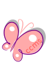

# Child Care Management System

The Child Care Management System or short "CCMS" is an open-source project aimed at providing a comprehensive and efficient solution for managing child care centers, daycares, and similar childcare facilities. This system is built on top of no-code or low-code applications, leveraging their simplicity and flexibility to enable easy customization and seamless integration.

⭐
If you like this project, please consider giving it a star!
It lets me know you're interested and motivates me to keep improving it in my free time.　
⭐

> [!WARNING] Local Use Only
> 
> This repository contains scripts for installing the application in a Docker container. These scripts are intended for **local development and testing purposes only**. They have not been secured or optimized for production environments.
> 
> - Do not use these scripts in a production environment without proper security auditing and hardening.
> - Ensure all sensitive information, such as passwords and API keys, are removed or properly secured before deploying online.
> - Review and modify the scripts to follow security best practices before using them in any public or production setting.
> 
> Users are responsible for implementing appropriate security measures before deploying this application online or in a production environment.

## Usable Version and Starting Point
The files in this repository can serve as a starting point for your deployment. Each release provides a foundation for the system, allowing you to begin managing your child care center's operations. However, please note that this is an initial version, and we have plans to implement additional features and enhancements in future releases. We encourage you to stay tuned for updates and contribute to the project's development.

## No-code Techs

Seatable - Version 0.4

Website: https://seatable.io/

## About Seatable

Seatable provides a flexible and customizable platform for data management, making it an ideal choice for deploying CCMS. By leveraging Seatable's powerful features, child care centers can streamline their operations, including data entry, record management, and reporting.

## Getting Started

To get started with CCMS using Seatable, follow these steps:
Import the CCMS files (ccms.dtable) into your Seatable.
Customize the CCMS configuration within Seatable to fit your child care center's specific requirements.
Set up forms and views in Seatable to manage child records, attendance, and other CCMS functionalities.
Start managing your child care center efficiently.

| APPS Features          | **Available** | **Form** |
| ---                    |    :---:      |          |
| Inscription            |     Yes       |   Yes    |
| Authority Inscription  |     Yes       |   Yes    |
| Activity               |     Yes       |          |
| Reports                |     Yes       |   Yes    |
| Staff Presences        |     Yes       |          |
| Child Presences        |     Yes       |          |
| Employee Reimbursements|     Yes       |   Yes    |
| Employee               |     Yes       |          |

NocoDB - Version 0.1

Website: https://www.nocodb.com/
Github: https://github.com/nocodb/nocodb
Docker Hub: https://hub.docker.com/r/nocodb/nocodb

## About NoCoDB
NoCoDB is a robust and versatile open-source platform that turns any SQL database (MySQL, PostgreSQL, SQLite, etc.) into an interactive spreadsheet-style interface. It enables users to create, customize, and share applications without writing any code, making it perfect for managing complex datasets and workflows.

## Getting Started
To set up CCMS using NoCoDB, follow these steps:

## Install NoCoDB:
Deploy NoCoDB using Docker, npm, or other installation methods (detailed in the official documentation).

**Connect Your Database:** Link NoCoDB to your preferred SQL database (MySQL, PostgreSQL, SQLite, etc.).

**Import the CCMS Schema:** Use the provided schema files:

- Activities.csv
- Inscription.csv

set up tables for managing child records functionalities.

**Customize Your Application:** Configure relationships between tables, define user permissions, and design forms for data entry.
Use NoCoDB's spreadsheet-like interface and form builder to adapt CCMS to your specific needs.

| APPS Features          | **Available** | **Form** |
| ---                    |    :---:      |          |
| Inscription            |               |          |
| Authority Inscription  |               |          |
| Activity               |               |          |
| Reports                |               |          |
| Staff Presences        |               |          |
| Child Presences        |               |          |
| Employee Reimbursements|               |          |
| Employee               |               |          |

Grist - Version 0.3

Website: https://www.getgrist.com
Github: https://github.com/gristlabs/grist-desktop

## About Grist
Grist provides a flexible and customizable platform for data management, making it an ideal choice for deploying CCMS. By leveraging Grist's powerful features, child care centers can streamline their operations, including data entry, record management, and reporting.

Link: https://www.getgrist.com/

## Getting Started
To get started with CCMS using Grist, follow these steps:

- Install Grist by referring to its documentation.
- Import the CCMS files (ccms.grist) into your Grist installation.
- Customize the CCMS configuration within Grist to fit your child care center's specific requirements.

Launch the CCMS on Grist and start managing your child care center efficiently.

| APPS Features          | **Available** | **Form** |
| ---                    |    :---:      |          |
| Inscription            |     Yes       |   Yes    |
| Authority Inscription  |     Yes       |   Yes    |
| Activity               |     Yes       |          |
| Reports                |               |          |
| Staff Presences        |     Yes       |          |
| Child Presences        |               |          |
| Employee Reimbursements|     Yes       |   Yes    |
| Employee               |     Yes       |          |

Rei3 - Version 0.0

Visit: https://rei3.de/
Docker file: https://github.com/r3-team/r3_docker/blob/main/README.md
Docker User/Password: admin/admin
Docs: https://rei3.de/en/docs/admin#docker
GitHub: https://github.com/r3-team/r3

## Getting Started

To get started with CCMS using REI3, follow these steps:

Install REI3 by referring to the REI3 documentation.
Import the CCMS files into your REI3 installation.
Customize the CCMS configuration within REI3 to fit your child care center's specific requirements.
Set up pages, components, and data structures in REI3 to manage child records, attendance, and other CCMS functionalities.
Launch the CCMS on REI3 and start managing your child care center efficiently.

| APPS Features          | **Available** | **Form** |
| ---                    |    :---:      |          |
| Inscription            |               |          |
| Authority Inscription  |               |          |
| Activity               |               |          |
| Reports                |               |          |
| Staff Presences        |               |          |
| Child Presences        |               |          |
| Employee Reimbursements|               |          |
| Employee               |               |          |

Directus

NocoBase

Visit: https://www.nocobase.com/
Github: https://github.com/nocobase/nocobase
Docker installation: https://docs.nocobase.com/welcome/getting-started/installation/docker-compose

Saltcorn - Version 0.1

Visit: https://saltcorn.com/
GitHub: https://github.com/saltcorn/saltcorn
Docs: https://wiki.saltcorn.com
Docker Hub: https://hub.docker.com/r/saltcorn/saltcorn

## About Saltcorn

Saltcorn provides a flexible and user-friendly platform for building database-driven web applications. It offers a range of features, including form builders, workflow automation, and role-based access control, allowing you to create robust and secure applications.

## Getting Started

To get started with CCMS using Saltcorn, follow these steps:

Install Saltcorn by referring to the Saltcorn documentation.
Import the backup-ccms.zip file from Settings/Backup.
Delete the sample data and users, change Admin email and password.

Defaults:
- Admin:    ccms@example.com    Password: 8a55w0rd
- User:     user@example.com    Password: 8a55w0rd
- User2:    user2@example.com   Passowrd: 8a55w0rd
- Staff:    staff@example.com   Passowrd: 8a55w0rd

Now, you can start to use CCMS application.

| APPS Features          | **Available** | **Form** |
| ---                    |    :---:      |          |
| Inscription            |               |          |
| Authority Inscription  |               |          |
| Activity               |               |          |
| Reports                |               |          |
| Staff Presences        |               |          |
| Child Presences        |               |          |
| Employee Reimbursements|               |          |
| Employee               |               |          |

Teable

| APPS Features          | **Available** | **Form** |
| ---                    |    :---:      |          |
| Inscription            |               |          |
| Authority Inscription  |               |          |
| Activity               |               |          |
| Reports                |               |          |
| Staff Presences        |               |          |
| Child Presences        |               |          |
| Employee Reimbursements|               |          |
| Employee               |               |          |

UnDB

| APPS Features          | **Available** | **Form** |
| ---                    |    :---:      |          |
| Inscription            |               |          |
| Authority Inscription  |               |          |
| Activity               |               |          |
| Reports                |               |          |
| Staff Presences        |               |          |
| Child Presences        |               |          |
| Employee Reimbursements|               |          |
| Employee               |               |          |

## News

20250116

After an intense period of relocation to Japan, I'm reigniting my passion and commitment to Child Care Management System. This journey isn't just about resuming work, it's about transforming challenges into opportunities, adapting to new environments, and proving that momentum can be rebuilt with strategic focus and determination. With renewed energy and insights gained from navigating international transitions, I'm ready to drive this project forward, bringing fresh perspectives and unwavering dedication to achieving this fantastic goal.### 20250116
After an intense period of relocation to Japan, I'm reigniting my passion and commitment to Child Care Management System. This journey isn't just about resuming work, it's about transforming challenges into opportunities, adapting to new environments, and proving that momentum can be rebuilt with strategic focus and determination. With renewed energy and insights gained from navigating international transitions, I'm ready to drive this project forward, bringing fresh perspectives and unwavering dedication to achieving this fantastic goal.

## Features

Child Management: Effortlessly manage child records, including personal details, emergency contacts, medical information, and attendance records.
Staff Management: Keep track of staff members, their roles, schedules, certifications, and important documents.
Billing and Payments: Simplify the billing process, generate invoices, track payments, and manage financial transactions.
Enrollment and Waitlist: Streamline the enrollment process, maintain waitlists, and manage availability.
Attendance Tracking: Track attendance for children and staff, generate reports, and monitor attendance patterns.
Communication: Enable seamless communication between parents, staff, and administrators through notifications, messages, and announcements.
Reporting and Analytics: Generate insightful reports and analytics to gain valuable insights into the operations of the child care center.
Integration: Easily integrate with other systems or platforms for data synchronization and enhanced functionality.

| APPS Features          | **Seatable** | **Reis3** | **Directus** | **NocoDB** | **NocoBase** | **Saltcorn** | **Teable** | **UnDB** | **Grist** |
| ---                    |     :---:    |    :---:  |    :---:     |    :---:   |     :---:    |     :---:    |   :---:    |   :---:  |   :---:   |
| Sign up                |              |           |              |            |      Yes     |      Yes     |            |          |           |
| Forms                  |     Yes      |    Yes    |     Yes      |    Yes     |      Yes     |      Yes     |            |          |    Yes    |
| Calendar               |     Yes      |    Yes    |     Yes      |    Yes     |      Yes     |      Yes     |            |          |    Yes    |
| Roles                  |    simple    |  complex  |    complex   |   simple   |    complex   |    complex   |   simple   |  simple  |           | 
| Electonic signature    |     Yes      |           |              |            |              |              |            |          |           |
| E2EE                   |              |           |              |            |              |              |            |          |           |
| Print                  |              |           |              |            |              |              |            |          |           |
| Export/import Templates|     Yes      |    Yes    |              |            |              |      Yes     |            |          |    Yes    |
|                        |              |           |              |            |              |              |            |          |           |
|                        |              |           |              |            |              |              |            |          |           |
| Data Integrity         |   built-in   |           |   built-in   |            |              |              |            |          |           |

Technology Description

The Child Care Management System is built on top of several no-code and low-code applications, providing a powerful and flexible foundation for development. These technologies were carefully selected to ensure the project's ease of use, scalability, and maintainability, empowering people of all skill levels to contribute and extend the functionality of the Child Care Management System.

Use case note

Please note that the use case and available features of the Child Care Management System (CCMS) can vary depending on the chosen no-code application. For instance, when deploying CCMS with Seatable, the system may leverage forms for data entry and management, providing a streamlined experience. However, Seatable may not support user logins for parents. On the other hand, deploying CCMS with NoCodeBase offers more robust user role management and customizable page features, allowing for tailored user experiences and versatile access controls. The selection of a specific no-code application will influence the functionality and capabilities of CCMS, enabling child care centers to choose the platform that best aligns with their unique requirements.

Installation and Usage

Within each section of "No-code Techs," follow the installation instructions for the underlying technologies.
Customize the system to meet your child care center’s specific needs by configuring the database schemas, workflows, and UI components and begin managing your child care center efficiently.

Contributing

Contributions are welcome! If you would like to contribute to the Child Care Management System, there are several ways you can get involved:

## Code Contributions

Since these no-code systems are not designed with coding contributions in mind, we welcome ideas and suggestions for integration with the project.

## Financial Support

If you find the Child Care Management System valuable and would like to support its development, you can contribute by donating through platforms like Ko-fi or Buy Me a Coffee. Your generous contributions will help me cover hosting expenses, implement new features, and improve the project's overall quality.

## Share Your Ideas

We believe in the power of collaboration and community input. If you have any innovative ideas, suggestions, or feature requests, we would love to hear them! Please create an issue in the GitHub repository with a detailed description of your idea. We appreciate your input and will review it as soon as possible.

## License
The Child Care Management System is released under the MIT License.

## Acknowledgments
We would like to express our gratitude to the developers and contributors of SeaTable, Rei3, NocoDB, NocoBase, and other open-source projects that have made this system possible.

## Support us

Support us on [Ko-fi] <a href='https://ko-fi.com/pieralberto' target='_blank'>

Buy me a coffee on [Buy Me a Coffee] 

## Customization and Installation Services

If you require customization of the Child Care Management System to suit your specific needs or need assistance with installation and configuration, we provide paid services to help you. Please reach out to us at `pier_alberto@pierini.com` for further details and pricing information. I'm dedicated to providing tailored solutions and ensuring a smooth experience for your child care center.